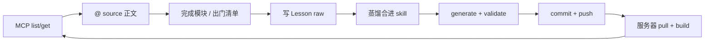

# 流程 Demo：MCP 查资产 → 干活 → Lesson 蒸馏 → 上传

**Language / 语言:** [English](../en/guides/mcp-work-then-distill-demo.md) | [中文](mcp-work-then-distill-demo.md)

> **文档级别**：使用指南（跨项目可复用）  
> **日期**：2026-07-17  
> **一句话**：MCP 只读发现「用哪份说明书」；干活与沉淀写在仓库 Markdown；索引用 generate 刷新；MCP **不写**正文。

本页是一条**端到端参考流程**。目录名可换成你项目里的约定；下面用虚构项目举例，文末附本仓对照。

> **本仓 SoT**：完整治理正文在 `Code/code/docs/zh/**`；MCP `source` 形如 `docs/zh/skills/...`。英文发现站为 stub，顶栏可切「简体中文」。

---

## 0. 角色分工（先记住）

| 谁 | 做什么 | 不做什么 |
|----|--------|----------|
| **MCP** | `health` / `list_*` / `get_*` → 返回 id、绑定、`source` 路径 | 不改文件、不记 Lesson、不部署 |
| **仓库 Markdown** | 角色 / 技能 / 规则 / Lesson 真源 | — |
| **generate + validate** | 从正文刷索引（manifest 等） | 不替代人工蒸馏判断 |
| **Git + 服务器** | commit / push / pull / build | 部署机勿提交生成脏文件 |

```text
查（MCP）→ 读（@ source）→ 干（改业务仓）→ 审（出门清单）
    → 沉（Lesson）→ 蒸（合进 skill/agent/rule）→ 刷（generate）→ 传（commit/push/build）
```

---

## 1. 前置条件

假设你已有：

1. 一份**治理索引**（HTTP MCP 或 stdio + `manifest`）  
2. Cursor（或同类 IDE）已配置该 MCP  
3. 本地打开**含治理正文的工作区**（以便 `@` MCP 返回的 `source`）  
4. （可选）业务代码在另一仓——流程不变，只是 Lesson / skill 落点不同  

---

## 2. Demo 故事（虚构）

**项目**：`acme-billing`（计费服务）  
**任务**：给「发票导出」模块加阶段出门检查，并把踩坑写回技能库。  

下面路径是**示例命名**，可任意替换：

```text
governance/                     # 你的治理仓或子目录
  agents/Architect.md
  skills/stage-gate/SKILL.md
  skills/stage-gate/docs/deploy-check.md
  ops/<project-id>/lessons/*.md
  public/manifest.json          # generate 产物
```

---

## 3. 阶段 A — 用 MCP 找模块（只读）

在 Cursor 对话中（示例话术）：

```text
用 <你的 MCP 名> 调 health，告诉我是否 ok、数据源是什么。
用 list_agents，再 get_agent 查 Architect，列出绑定技能和 source。
用 list_skills 找到 stage-gate，get_skill 后给出 source；我要 @ 该路径做出门清单。
```

**期望结果（示意）**：

| 步骤 | 你应看到 |
|------|----------|
| health | `ok: true`，以及 manifest / 数据源说明 |
| get_agent Architect | `skills: ["stage-gate", …]`，角色 `source` |
| get_skill stage-gate | **`source`: `governance/skills/stage-gate/SKILL.md`**（示例） |

**纪律**：先 list/get 再 `@`；单任务 **1 个主 skill**，辅 skill 最多 2 个。  
**禁止**：让 MCP「写入 Lesson / 改 skill」——没有、也不需要写接口。

---

## 4. 阶段 B — `@` 正文干活 + 出门

1. 在对话里 `@governance/skills/stage-gate/SKILL.md`（用你拿到的真实 `source`）  
2. 按其中的**可执行清单**勾选当前任务能否出门  
3. 若涉及上线：再 `@` 清单里指向的部署细则（例：`docs/deploy-check.md`）  
4. **证据分层**（易错点）：  
   - MCP `health` 绿 ≠ 静态站已用正确 Host 验收  
   - 本机无 SSH 时标「部分证据」，勿默认部署项全绿  

业务代码仍在 `acme-billing` 仓改；治理仓只提供「怎么做 / 出门标准」。

---

## 5. 阶段 C — 记一条 Lesson（写文件，不经 MCP）

触发句模板：

```text
记一条 lesson：<一句话现象>。项目 <project-id>。
按 ops/_template/lesson.md 写入 ops/<project-id>/lessons/YYYY-MM-DD-short-slug.md。
不要调用 MCP 写入；MCP 只读。
```

**本 Demo 填空示例**：

| 字段 | 示例值 |
|------|--------|
| 一句话现象 | 出门时把 MCP health 绿当成整站部署已验收 |
| project-id | `invoice-export-gate` |
| 文件 | `ops/invoice-export-gate/lessons/2026-07-17-mcp-health-not-full-deploy.md` |
| status | 先 `raw` |

卡片至少包含：现象 / 期望 / 上下文 / 建议沉淀形态 / 证据。  
**禁止**写密钥、Token、未脱敏客户数据。

---

## 6. 阶段 D — 扫描 → 蒸馏 → 合进可复用正文

扫描（本机 glob / ripgrep 即可，仍不用 MCP）：

```text
扫描 ops/**/lessons/*.md，按 frontmatter 的 status
列出 raw / distilled / merged，建议下一步蒸馏或关闭。
```

| status | 含义 | 下一步 |
|--------|------|--------|
| `raw` | 现场记录 | 提炼文案 → `distilled`，或评审否决 → `rejected` |
| `distilled` | 可合入 | 改 skill/agent/rule 正文 → `merged` |
| `merged` | 已进可复用正文 | 归档，勿再当待办 |

**本 Demo 蒸馏动作（示例）**：

1. 把「MCP health ≠ Host 部署探测」写进 `governance/skills/stage-gate/docs/deploy-check.md`  
2. 在主 skill 出门清单加一句「分开记证据」  
3. Lesson：`status: merged`，蒸馏笔记写明合入路径  

**禁止**：用 `raw` 直接覆盖公共 skill 长文而不经蒸馏判断。

---

## 7. 阶段 E — generate · validate · commit

在**治理仓**（或你生成索引的目录）执行：

```bash
# 名称按你的 package scripts 替换
npm run generate
npm run validate
git add <改过的 markdown 与索引产物>
git commit -m "docs: distill invoice-export lesson into stage-gate deploy check"
git push
```

要点：

- 只改正文时：刷新索引即可；**不必**为 MCP 加写 tool  
- 勿提交：`.env`、本地笔记、密钥  
- PowerShell 若不能用 `&&`，分两行跑 generate / validate  

---

## 8. 阶段 F — 服务器 pull + build（上传）

```bash
# 部署机示意
git pull origin main
# 若有上次 generate 脏文件挡住 pull：git restore .（勿在部署机 commit 产物）
cd <站点构建目录>
npm ci && npm run build
```

验收时（示意）：

- 静态资源 / 健康检查：**带正确 Host**（或走公网域名）  
- MCP：同源 manifest；仅改 docs 时通常不必重启进程；改了 MCP 服务代码再重启  

Cursor 里再 `health` / `get_skill` 抽查索引是否已含新文案（缓存约数十秒属正常）。

---

## 9. 一张图串起来



---

## 10. 复制用检查清单

- [ ] MCP `health` ok；知道数据源  
- [ ] `get_*` 拿到主 skill 的 `source`  
- [ ] 已 `@` 正文执行（非只读摘要）  
- [ ] 出门清单已勾；部署证据已分层  
- [ ] Lesson 已落盘（或显式「本阶段无新教训」）  
- [ ] raw → 蒸馏 → 正文已改 → Lesson `merged` / `rejected`  
- [ ] `generate` + `validate` 通过  
- [ ] commit / push；服务器 pull + build  
- [ ] **未**要求 MCP 提供写接口  

---

## 11. 本仓对照（Agents-Skill-Site）

| Demo 概念 | 本仓落点 |
|-----------|----------|
| 治理正文（中文全文 SoT） | `Code/code/docs/zh/**` |
| 英文发现站 stub | `Code/code/docs/**`（VitePress root） |
| Lesson | `Code/code/docs/zh/operations/<project>/lessons/` |
| 模板 | `.../zh/operations/_template/lessons/_lesson-card.template.md` |
| 主 skill 例 | `docs/zh/skills/custom/common/stage-gate-flow/index.md` |
| 部署细则例 | `.../stage-gate-flow/docs/deploy-verify.md` |
| generate | `cd Code/code && npm run generate && npm run validate` |
| 远程 MCP | Cursor `agents-skill-remote`（只读；`source` → `docs/zh/...`） |
| 真实回灌例 | `stage-gate-exit-evidence` → deploy-verify「证据分层」 |

工程规划细节见 [`Doc/phase3/`](../phase3/README.md)；Lesson 状态机见 [`operations/README`](../../Code/code/docs/zh/operations/README.md)。英文精选：[`Doc/en/`](../en/README.md)。

---

## 修订记录

| 日期 | 说明 |
|------|------|
| 2026-07-17 | i18n：SoT → `docs/zh`；补英文镜像与语言互链 |
| 2026-07-17 | 初稿：跨项目流程 Demo（MCP → 干活 → 蒸馏 → 上传） |
